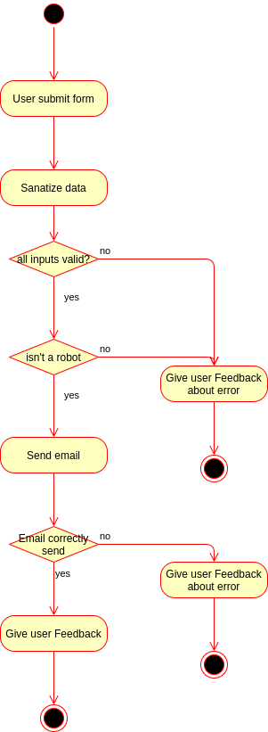

# projet-formulaire HACKERS POULETTES

## BUT
mise en application des connaissances apprises sur php en créant une boutique en ligne.

## Le formulaire
Cette partie du travail est particulièrement importante et un soin minutieuse sera apporté à la sécurité(validation et sanatization).

## le groupe
- Léonard Stéphane (front et back)
- Lorand Pierre (front et back)

## répartition du travail
Nous avons réparti le travail pour que l'ensemble du groupe puisse avoir la possibilité de travailler sur la sécurité apportée quand à la saisie de données par un utilisateur.

## Graphique UML

